# COMP1531

[toc]

# COMP1531 Guidebook

## 🏋🏼 Your relationship with the course

### Key Principles

* We don't tackle problems with negativity and resentment, we always try and move forward in a positive and constructive way
* We focus on being high performing within the scope of our role, yet try to avoid COMP1531 bleeding into our personal lives 24/7

### Rules of Engagement

* Tutors should not be critical about the course or the course staff in front of students; escalate please; we aren't forcing you here, we can find other tutors
* Tutors should avoid over-emphasising tooling, and also avoid having over-complicated setups when demonstrating code, it can overwhelm students
* These are the following channels of communication:
  * Emailing LiC directly
  * Emailing the LiC plus the relevant special-role tutor
  * Posting in #General or other fully public channels, ideally always tagging at least one individual

## 👨🏽‍🏫 Your relationship with the students

### Key Principles
* We're here to turn students from hobby programmers into the first stages of being a software engineer
* Resilience and internalization are skills we want to focus on greatly improving with our students
* We empower students to become their own heros of solutiosn to their problems

### Rules of Engagement

* The expectation is put on students to reach out when they have problems and communicate
* Respect and maturity shown between everyone (staff and students) is extremely critical. Failure to do so will not end well for those that fail to do so.
* You are able to resist students direct messaging you on teams, and instead prefer all communication to go over email

## Our Roles

Every teaching staff member, whether a tutor, lab assist, or help sessions only, is an equally respected and talented part of the tutoring team.

Every tutor will engage with at least number of these key responsibilities:
 * Running a tutorial
 * Overseeing a group in a lab
 * Participating in help sessions
 * Managing the forum
 * Senior Roles (below)

Senior roles (in no particular order):
 * Course website management (Tam)
 * Forum & Help Session Manager (Junya)
 * Project ex. solution backend (Giuliana)
 * Tutorials (Amber)
 * Labs (Amber/Sandeep)
 * Project Solution (Darcy)
 * Deployment (Sandeep)
 * Final Presentations (Junya)

Teams aliases have been set up for you:
 * **ProjectSolution**: For anything relating to the project - solution frontend or backend, Spec, automarking, reruns, scaling, etc
 * **Deployment**: Anything to do with Deployment
 * **Tutorials**: Anything to do with tutorials
 * **Labs**: Anything to do with Labs
 * **Help Session**: For anything relating to help sessions
 * **Forum**: For anything relating to forum
 * **Lecturers** For Yuchao and Yuekang

## Key Resources

### Tools we use in the course
 * Gitlab
 * Marking Spreadsheet
 * Course Website
 * Forum
 * MS Teams
 * UNSW Email

### Other Resources
 * [The tutor wiki - old but useful](https://webcms3.cse.unsw.edu.au/TUTR0101/00x0/)

## Notes on pay & access

### Castle Hours

All tutors get paid for:
  * Time in the tutorial (including prep) and time in the lab
  * Approximately 1 hour in preparation each week overall for new COMP1531 tutors
  * Marking time for groups. It's about 30 minutes per group for iteration 0, 60 minutes for iteration 1, and 50 minutes per group for other iterations.
  * Some extra time for managing groups that will occur outside of class over email
  * Participation in a 30 minute meeting every week. No attendance + no recording watching = no pay

You are paid for the work you do, and not paid for the work you don't do, but it's important that all work, where reasonably possible, needs to be confirmed in advance. Failure to confirm that work is appropriate if it extends beyond the agreed upon hours may get tricky.

As of 25T1, there are new paycodes that will be used to disambiguate work previously under `OTH DUTY`:
- `CCO` Course Coordination - activities  required for the delivery of a  course
- `CRDV` Course development
- `DMPR` Preparation for practical  class
- `LATT` Lecture Attendance - attendance required at  Lecture relevant to course
- `MTG` Meeting - attendance at  course, school or Faculty  meeting
- `SCO` Student Consultation - Formal or informal student  consultation performed face  to face or online e.g. forum & help sessions
- `TRN` Training - attendance or completion of training
- `OTH DUTY` - if none of these categories fit, but informative descriptive required.

Each of the sub-paycode, has 3 variants:
- `STD` - default  (90+% of CSE casuals)
- `PHD` - casual has a PhD (higher pay rate)
- `CCO` - causal is doing full coordination for the course (same higher pay rate as PHD)

### Access & Hiring

The uni is slow to process hiring at the moment because of uni hire. This means that people who aren't active UNSW students or are first time tutors may have delays.

If this is your first time tutoring (in any CSE course), you may not have card access to some lab rooms in the first few weeks.

It may also take up to 3 weeks for you to be registered on the casual academic system, so if you wish to obtain a staff card, going in week 4 is a safe bet.

Access will be granted to your student card even if you don't get a Staff card.

## 💂‍♀️ Class time - Tutorials

### Basic information
 * Online tutors will complete their classes over MS teams.
 * You can message your group on MS teams at any time, or email them at an alias similar to cs1531.tue15a@cse.unsw.edu.au

### Principles informing your teaching
 * Engagement is the most important part of tutorials, the less you speak the better
 * Choose whatever questions you want, its your community, we trust you
 * Stop doubting yourself
 * Have fun
 * You're there to bring out the best in them, not to be amazed by your own brilliance

### Attendance
 * Tutorial attendance and participation contributes to an individuals overall grade, so its imperative you take notes of this as it will be relevant when marking.
 * If a student misses one class (tute and/or lab) during the term, you can treat it as a one-off incident, and if they performed and attended in all other classes, they can still comfortably get all "ticks" for that part of the marking. Regardless, you should still encourage students to apply for special consideration as it may help them if they have to skip another lesson in the future they can't get consideration for

## 🌯 Class time - Lab times

Lab times are MENTORING sessions for you to provide guidance and help make sure that both individuals and groups are functioning.

It is a multi-layered time where a few different responsibilities kick in.

* All tutors will have 3 (sometimes 2) groups to manage for the term
* All lab assists will have 2 (sometimes 3) groups to manage for the term

You are responsible for all the project marking of your own groups.

You will need to devote 40 minutes in each lab slot to a group. How you break that up is up to you. In this time you will need to do their project check ins, check on their lab progress & give them feedback on their lab, and manage reruns. Each group is entitled to 40 minutes of time, in general. It is OK to take some time away from one group and give it to a more troubled group if that seems complicated. How to balance your project check-ins, lab check-ins, is up to you.

For any tutor that only has 2 groups, your final 40 minutes of the 2 hour lab slot will consist of a mini-help session where we publish your location and students are welcome to come drop by for brief help. If no students drop by we expect you to be checking the forum for questions.

Notes for these sessions can be found in the appendix.

### Project check-in element

You can prepare for the check-in element by being familiar with the project specification.

Focus on using this time to identify and distinguish performance of individual students, as well as ensure that the group is sufficiently on track.

You can also use this time to provide students with technical help and debugging on their project.

### Lab Marking & Re-run Element

During the lab-focused time, you will mostly spend time:
 * Checking on the progress of students labs
 * Assist students with lab exercises
 * Reviewing their lab work and providing feedback

In general you won't have to "mark" labs, though you may be required to assist students with submitting a lab re-run. Please see the lab re-run section in the appendix.

Lab assistants are also to check in with individual students to roughly track their progress and record the information in the marking spreadsheet. This includes

 * lab completion of the previous week (non-attempt, partial attempt, full attempt)
 * lab attendance for the current week

The check-in should happen in weeks 4, 7 and 9.
The main objective is to encourage students to stay up-to-date with course contents and make at least a partial attempt in the core labs. The most important of which are

 * lab01_git
 * lab01_objects
 * lab03_diary
 * lab04_encanto
 * lab05_checkins

For lab01, you will only need to check verbally - the sheet is not ready at this time due to varying enrolments. Please also inform students that you will be keeping tabs on their work in future core labs.

### Help Session Element

If you only have 2 groups, the last 40 minutes of your lab time will be spent with your room (or online) being published to all students who can drop in for help.

The exact same "help session" principles apply in this scenario, though we are adding no operational overhead for anything to do with hopper, unless you're an online lab.

If you do not have any students appear, it is expected you spend this time instead helping out on the forum. Like all forum things, if you aren't confident in your answer, please post it as hidden (staff) and DM the forum manager to help

## 🔬 Assessments - Labs

All labs are automarked.

Students are given a 30-minute grace period past the due date to submit lab issues. Please do not advertise this to students.

## 🚀 Asessment - Project

### Marking

We expect tutors to mark their project
 * Tutors will mark students in weeks 3, 5, 8, 11, and can use the project check in times to assist in marking
 * All marking turn around is within 1 week - all in the tutor material;  this is a requirement of the role

####  Individual Marking

It is important to note that we view marking of the project as a completely individualistic experience.

Tutorial and lab attendance and participation will inform individual marking.
 * If a student doesn't turn up to tutorials they lose 10% of project mark
 * If a student "half" engages (e.g. attend but fragmented webcam / participation) scale down by 5%

[Analytics provided by course scripts](https://cgi.cse.unsw.edu.au/~cs1531/raw/contrib-f9sdjf80ej08f2j40rj834/24T2/) on group repos will also inform individual marking. These will be available shortly after submission.

Peer reviews will occur at the end of iterations 1-3, which you will have access to. As a general rule, peer reviews do not need to be taken into account if most students grade most of their peers mostly well. It is instead a tool to help you identify consistently poorly behaving group members.

Many marking components are by default individual, however, some components are group based such as:
 * Manual marks given to coding
 * Automarking marks

For these marking components that are "group" marked, we can apply scaling factors if there is unequal contributions in the groups. This draws upon the results of the peer review, tute/lab participation and attendance, and results from the contributions script.

### Leaderboard

A leaderboard will be provided that runs students code against our tests every night for the last 7 days, and displays it. This will be handled through the course website.

### Scaling Students (individual contributions)

All up-scaling needs to be approved by the tutor running automarking + LiC via the `project scaling & reruns` teams channel to ensure fairness.

Please post the group name, zIDs, the auto-generated scaling, your proposed scaling, and reasoning for each.

For 25T2, with the overall project weighting being much lower due to having a final exam, we should see less scaling requests - this means you can be more "forgiving" of teams where there are slight variants in contributions and effort. This is because the project is no longer the only major source of marks.

Tips for scaling:
* Utilise the suggested scaling from the peer review form as a **guide** not something you should copy and paste. It only takes into account peer review, and often lacks the full context you need to provide an accurate mark.
* Try to ensure the scaled value doesn't exceed the total if the group wasn't scaled e.g. a group of 4 might be scaled to 0.9, 0.9, 1.1, 1.1. This is a maximum value, and not a minimum, so you can have 0.9, 0.9, 1, 1 too.
* Generally don't exceed 1.25 for an individual student unless they have special consideration/extenuating circumstances discussed previously with the project admin.
* If peer assessment suggested scaling looks close to all 1's, and contributions look mostly even (i.e. a few hundred lines off each other), you can give the group all 1's for scaling, you don't need to ask for approval for this.
* Once approved, please copy the scaling across to the marking spreadsheet yourself. Students will receive 0, and not 1 by default otherwise.
* Scaling should be to the nearest 0.05 -> if you find yourself needing to scaling increments less than this then giving all 1's or rounding should be sufficient.
* For groups of 3 we generally don't give special consideration with scaling since they usually have less group admin and issues which offsets the increased workload. In the case where they have disruptive group members (e.g. a 4th group member commits to doing work then drops the course less than a week before due date) we would consider scaling where the sum exceeds 3 for this group.
* Scaling can become increasingly weighted as the iterations progress. For example if student A is scaled down by 0.8 in iteration 1 for missing meetings and not working on things until last minute and their behaviour is repeated in iteration 2, you may scale them down to 0.7. This is both because they should show improvements throughout the course, but also because iteration 2 and 3 are more intensive and disruptive behaviour is more impactful on other team members.
* Each iteration should require at least 2-4 functions/routes per person generally. If it looks like a student has done less than their fair share, even if it is high quality work, they should be scaled down slightly. E.g. getting 50% of the work done compared to their team members, even if agreed upon by those team members, means the student should be considered for lower scaling - depending on the quality of work and iteration, this may look somewhere in the range of 0.3-0.7.
* If a group does poor overall e.g. only completing 1 route each for an iteration with no tests, you don't need to apply any scaling. Their manual marking and automarking will result in an accurate group mark.
* Students that don't commit every week can be scaled down to 0.8 as per the spec requirements. You can use your discretion to enforce this.

Examples of when to scale students to what percent (these are flexible guides only, your group's situation may and often would be more unique than these generalizations)
* 0: No contributions at all. No meeting attendance, no code on branches or in master.
* 0.1-0.2: Some meeting & tutorial attendance, or very broken code attempts made on branches that never made it in to master.
* 0.3-4: Some meeting & tutorial attendance, some code in master. Code is either small in amount, or not very good quality compared to their other team members.
* 0.5: Does around 50% of the workload of their team members to an okay standard of quality. The factors that cause them to do less work might vary e.g. starting late, not attending a couple meetings or tutorials.
* 0.6-7: Does somewhere between 50-80% of the workload of their team members to varying quality, but might demostrate other flaws like starting late or not attending meetings.
* 0.8-9: They complete most to all of their assigned work but start late, miss meetings, generally cause a small headache for their other team members in some way.

### Reruning automarking

All re-running will now be centrally handled through the course website. Information about this is spread between the course website and the spec.

Students may ask for assistance with automarking, you can assist them, but do not share course tests with them.

### Other Notes

If a person changes groups/tutorials we can use part of their marks from their previous group.

### Project demos
Project demos are ~20min slots during the lab following an iteration deadline. They serve two purposes
1. Make marking easier for tutors (including individual contributions/scaling)
2. Provide groups the opportunity to reflect on the iteration, and provide them with feedback to help them improve for future iterations/projects

Demos aren't formalized presentations that groups need to prepare extensively for, however, it is expected they complete the relevant `iterX.md` group reflection before their scheduled lab/demo time slot. As a tutor, you must;
1. Document who attends the demo (lack of attendance may result in 0 scaling for that iteration without special consideration). Make this note in the absentee colum of the marking spreadhseet.
2. (iteration 2+ only) Having them demonstrate their code working with their frontend, and awarding a mark for it in the spreadsheet according to the criteria. Sanity check that when demo'ing their code `git log` is checked out on their submission branch
3. Glance at the contributions graph for the work, and anyone who did not contribute very much quiz them about the reasons they didn't get much done and try to quickly cross-examine them and then leave a note of anything relevant in the spreadsheet. Alternatively just ask each group member for a 10 second explanation of what they did in the project and take note of that, using their end-of-iteration reflection as a guide.
4. If any code looks suspicious of plagiarism/LLM usage, quiz the team member that wrote the code to have them explain what it is doing. If they cannot explain the code, note this down and apply a 10-20% scaling penalty depending on the scenario. Please mention this in your scaling approval message, since these circumstances need to be manually approved by the admin team. When providing feedback to students, be clear this scaling was applied due to their inability to explain their code, and NOT because of AI/plagiarism concerns since that is particularly hard to prove.
5. Glance over their end-of-iteration reflection and provide feedback to the group if you believe they are missing reflection notes that would help them improve for future iterations.

As the tutor, you may chose how to conduct these demos e.g. sharing your own screen may speed things along, and swapping to the students screen when conducting the demo with the frontend after going through their code and contributions with them. You may choose to prioritise discussions around individual contributions for groups struggling with workload balancing, or code quality for groups that may have performed poorly in the previews. Hence, there is no set 'formula' for every project demo.

Some students may not be used to time-bound demos, so don't hesitate to take the lead in directing the demo, especially if students are wasting time on a small thing e.g. "It's OK, you don't need to show me X, lets move on to Y instead since it is more important."

You may choose to provide the group with informal feedback during this demo on the quality of their work, however you should still provide written feedback via the marking spreadsheet and marking MR for the iteration. Comments for a group are the last column in the iteration tab.

## Help Sessions

### Goals

Help sessions are another important resource for students. We want to help students build their critical thinking skills, answer their queries in a proffessional and warm way, and ensure we're applying appropriate effort equitably into students across the board.

We also need to do this in a way that balances enabling students to solve their own problems.

Your objective is to empower the student to be equipped to continue. You are not a "solver" of their problems (i.e. you are not pair programming with them), you are an "unblocker" of their ability to be the "solver" of their problems.

If they have an inability to debug, we can link them to debugging resources.

### Tutor Guidelines
If you're a tutor scheduled onto a help session, you're responsible for the following:
- Attend the help session on time OR let us know at minimum 24 hours beforehand if you'll be late/need a substitute
- Post a link to the queue for students within 5 minutes of the session start (see workflow section in appendix)
- Take care to listen carefully to the student's entire request, before responding to the core issue relevant to their problem in a friendly and professional way
- Equitably distribute your time across all students in the help session (and forum!) (see rough expectations section in appendix section)
- Post in *Help Sessions* channel on Teams, if tutors are overwhelmed in a project deadline week. We *might* be able to get additional tutors to help out.
- You must report on your help session shift (see `help session reports` tab in the marking sheet). We suggest filling this out after each student as you go.
- Please post about any student/group issues you were not able to resolve in *Help Sessions* channel on Teams! This way the course can follow-up and make sure no one slips between the cracks.
- The help session manager may sometimes come into the help session to check on how things are
- No preparation is required for help sessions beyond your usual role

To ensure a fair workload across all tutors, we will be spot checking punctuality, answers to requests, forum activity, and help session reports.

For more information on expectations, notes, and workflow, see the appendix.

## Forum
### Expectations
The forum is an important platform for student communication. We want to build a __friendly and self-reliant learning community__ and respond to queries accurately and within a reasonable timeframe. To ensure that this goal is achieved, tutors on the forum are expected to:
 * __Be friendly, inclusive, and professional. 💗__
   * Include a greeting e.g. "Hi <name>" and an end "Let us know how you go!" to your post.
   * Have a friendly and helpful tone e.g. greet the student, use empathetic language.
   * Avoid coming across as dismissive, belittling, passive aggressive and/or critical of the student or the course.
   * Private posts that are rude, discriminatory, or otherwise inappropriate towards students, staff, or the course. If in doubt, private first and double-check.
 * __Give accurate and thought-provoking answers. 🧐__
   * **A bad forum answer is worse than no forum answer.** Prioritise accuracy over speed. Make sure you backup your answer with an official resource. Else if you're at all unsure, feel free to write a private answer to staff and ask for a review and/or tag the relevant people. Fixing misinformation, takes at least 5x the resources of waiting.
   * If you think that there is a pre-existing answer that is misinforming the student, please correct the answer. If you are unsure if the answer is correct, please private the post, reach out to relevant tutors and resolve accordingly.
   * Answers should be the most minimal next-steps NOT how-to guides. Provide steps the student can take, a minimal code sample, and/or resources to encourage their own investigation.
   * Mistakes are inevitable,so if you do give misinformation, edit your post with the correction and strikethrough/otherwise indicate the incorrect response. Try to avoid deleting your post as this causes confusion. Please also bump the student by making a new post, since editing a message does not notify the student.
   * Ensure that you read the spec before answering questions, as things may change since you last developed knowledge on the topic.
 * __Communicate responsively. 🍵__
   * Prioritise resolving older questions to avoid questions getting falling through the cracks, aiming to have:
     * All forum questions have a first response within 24 hours
     * 90% of forum questions are resolved within 24 hours
     * All forum questions are resolved within 72 hours
   * You are responsible for fully resolving the threads you answer OR explicitly passing it on to another tutor/ forum manager. Do NOT mark a post as "Resolved" (green tick) when you're still investigating an appropriate answer.
   * You are responsible for responding to student replies to your answer if it's relevant OR asking them to make a separate post. Please ensure that our average time to first follow-up to student reply is within a 1-3 hour range so that we don’t accidentally cause a feedback loop that creates more, less quality, questions
   * You only need to check for a student follow-up reply up to a week after your initial answer.
 * __Encourage a learning culture. 👨🏾‍👩🏼‍👧🏻‍👦🏽__
   * Endorse and contribute to student answers, rather than writing new tutor ones.
   * Check for duplicate questions, incorrect tags, non-descriptive titles, private posts that could be public, etc. In these cases either ask the student to edit their post or edit their post and let them know about it. This way we can improve forum usefulness and search indexing for everyone.
   * Pin useful posts! There is a general and iteration specific FAQ. As you come across useful posts, please add them where appropriate and update the timestamp in the info box so student's know something has been added.

### Getting Paid
Forum time done outside of core role responsibilities is unpaid, so we generally discourage it.

You MUST  legally  be paid how much you're working. You are being paid per answer and per comment (rates listed below). So make sure that you are spending that time accordingly and recording any extra time you are spendng on an answer or on communicating with the student. There will be a post for each iteration where you can track how much extra time you spent on particular posts as you go.
| Iteration | $/answer | $/comment |
| --------- | -------- | --------- |
| Setup     | 6.5      | 1         |
| 0/1       | 6.5      | 1         |
| 2         | 7        | 1         |
| 3         | 5        | 1         |

# A. Appendix

## A.1. Weekly Todos

### A.1.0. Week 0

Notes:
 * Group preferences last submission date is Monday 12pm. Any late preferences should be forwarded to the class account.

Unique preparation / admin:
 * (All) Complete all of your relvant unihire & castle forms as they come in
 * (All) Check you have access to the marking sheet
 * (All) Message one of the new tutors in COMP1531 and say hello!
 * (Tutorial only) Create an MS teams for your class and make a hello post.
    * Paste the name of the AD groups (IDM_CLS_ENG_COMPSC...) on the Add Members popup window in the box that says "Start typing a name or group" (also see below)

    ```text
    TLB	T17A	UGRD	IDM_CLS_ENG_COMPSC_UGRD_COMP1531_T3_5269_9536
    TLB	W09B	UGRD	IDM_CLS_ENG_COMPSC_UGRD_COMP1531_T3_5269_9539
    TLB	W11B	UGRD	IDM_CLS_ENG_COMPSC_UGRD_COMP1531_T3_5269_9541
    TLB	W13A	UGRD	IDM_CLS_ENG_COMPSC_UGRD_COMP1531_T3_5269_9542
    TLB	W13B	UGRD	IDM_CLS_ENG_COMPSC_UGRD_COMP1531_T3_5269_9543
    TLB	W15A	UGRD	IDM_CLS_ENG_COMPSC_UGRD_COMP1531_T3_5269_9544
    TLB	W15B	UGRD	IDM_CLS_ENG_COMPSC_UGRD_COMP1531_T3_5269_9545
    TLB	W17A	UGRD	IDM_CLS_ENG_COMPSC_UGRD_COMP1531_T3_5269_9546
    TLB	W17B	UGRD	IDM_CLS_ENG_COMPSC_UGRD_COMP1531_T3_5269_9547
    TLB	H13A	UGRD	IDM_CLS_ENG_COMPSC_UGRD_COMP1531_T3_5269_9530
    TLB	H13B	UGRD	IDM_CLS_ENG_COMPSC_UGRD_COMP1531_T3_5269_9531
    TLB	H15A	UGRD	IDM_CLS_ENG_COMPSC_UGRD_COMP1531_T3_5269_9532
    TLB	H15B	UGRD	IDM_CLS_ENG_COMPSC_UGRD_COMP1531_T3_5269_9533
    TLB	H17A	UGRD	IDM_CLS_ENG_COMPSC_UGRD_COMP1531_T3_5269_9534
    TLB	H17B	UGRD	IDM_CLS_ENG_COMPSC_UGRD_COMP1531_T3_5269_9535
    TLB	F09A	UGRD	IDM_CLS_ENG_COMPSC_UGRD_COMP1531_T3_5269_9522
    TLB	F11A	UGRD	IDM_CLS_ENG_COMPSC_UGRD_COMP1531_T3_5269_9524
    TLB	F11B	UGRD	IDM_CLS_ENG_COMPSC_UGRD_COMP1531_T3_5269_9525
    TLB	F13A	UGRD	IDM_CLS_ENG_COMPSC_UGRD_COMP1531_T3_5269_9526
    TLB	F13B	UGRD	IDM_CLS_ENG_COMPSC_UGRD_COMP1531_T3_5269_9527
    TLB	F15A	UGRD	IDM_CLS_ENG_COMPSC_UGRD_COMP1531_T3_5269_9528
    ```

#### A.1.0.1 Creating a Microsoft Teams Team for your Tutorial
Here's a quick guide on how to setup your tutorial team for new tutors! This is my personal preference, so we're happy for you to customise your tutorial team however you'd like.

**1. Create a new Microsoft Team team!**

I use > `From Template` > `Class`, but anything works here 🤷
Add a clear team name and any description, I use `COMP1531 25T2 W15A` and write the time and location in the description.

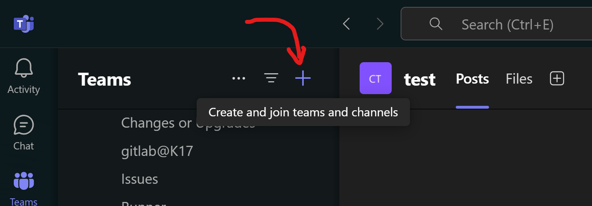

**2. Add your co-tutor and your students.**

Make sure your lab assistant has co-owner abilities so they can make changes too 🙌
To add your students you should use the "AD Groups" codes above ^.

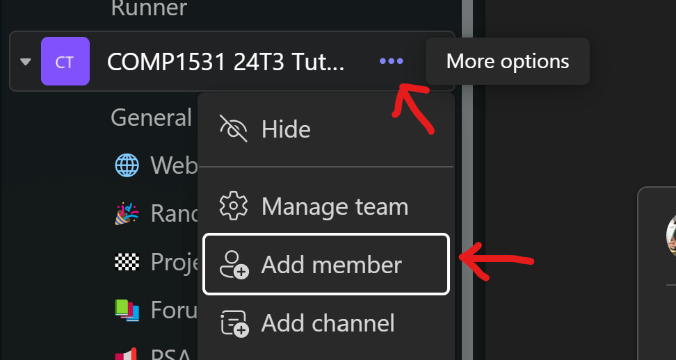

The code that adds all your students should look something like this:

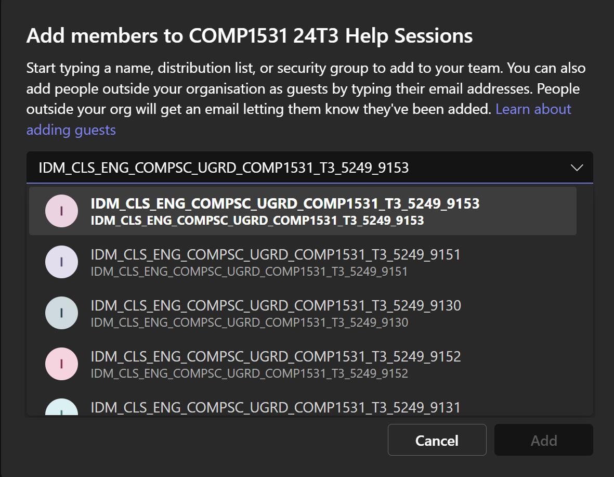

Note: this group won't dynamically update your class with new enrolments. You can add those students manually when they raise the issue or re-add the same group later on e.g. on **Week 2 Monday** after class registration closes for almost all students 🌸

**3. [Optional] Customize! And get students engaged 🎨**

I like to set a team icon, write an initial post, and add some extra channels for social purposes (e.g. JavaScript memes). But you can do whatever you want to create the community and environment that works for your class 🫂

Here's what my previous teams looked like:

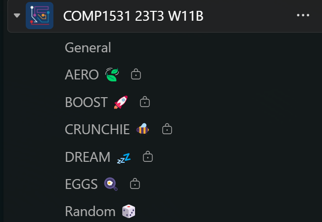

#### A.1.0.2 Email Aliases

You can email all students in your class via cse email aliases. This will be `cs1531.[YOUR-CLASS]@cse.unsw.edu.au`.

To find your class you can check the timetable on [https://timetable.unsw.edu.au/2026/COMP1531.html#S3](https://timetable.unsw.edu.au/2026/COMP1531.html#S3) or [https://cgi.cse.unsw.edu.au/~give/Admindata/26T3/COMP1531_timetable.html](https://cgi.cse.unsw.edu.au/~give/Admindata/26T3/COMP1531_timetable.html).

Full list of email aliases for 26T2 below:
```md
cs1531.tue17-pipa
cs1531.wed09-pipa
cs1531.wed11-pipa
cs1531.wed13-lute
cs1531.wed13-tabla
cs1531.wed15-strings
cs1531.wed15-tabla
cs1531.wed17-pipa
cs1531.wed17-tabla
cs1531.thu13-lute
cs1531.thu13-sitar
cs1531.thu15-flute
cs1531.thu15-oboe
cs1531.thu17-flute
cs1531.thu17-harp
cs1531.fri09-pipa
cs1531.fri11-pipa
cs1531.fri11-tabla
cs1531.fri13-harp
cs1531.fri13-pipa
cs1531.fri15-flute
```

If you need to double-check who is on your alias, run `mlalias <alias-name>` from a cse terminal.

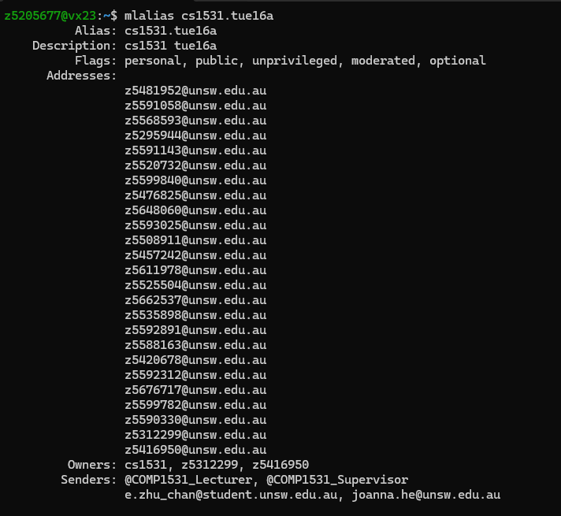

#### A.1.0.3 Tutorial Welcome Email Template
I prefer communicating over MS Teams so here is my ANCIENT email template and my MS Teams tutorial template! Credits to Sienna Archer, Peter Derias, and the many other tutors over the years which this template has stolen ideas from.

---
Hi everyone,

Welcome to COMP1531! I am Rani, your tutor 😊
❗ IMPORTANT: I will be making **📣 all announcements via MS Teams 📣** this term. I'd highly suggest downloading the MS Teams desktop and phone application so you can receive notifications as you see fit and stay up to date on important information.

Please **⛳ read and react to this linked message below ⛳** to get started (you'll need to login with your [UNSW student account](https://www.student.unsw.edu.au/teams-students)):
- [Rani Jiang: [Week 0] Welcome! 🌊]()

If you are unable to access the [tutorial team](), **please email me immediately** so I am able to add you!

See you there,

Rani

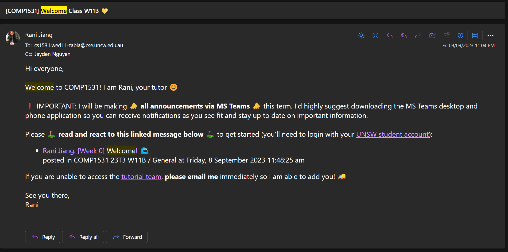

---

Hey General, welcome to COMP1531! I’m Rani 🤠 and I will be your tutor for this term 🏯.

❗ **IMPORTANT**: It would be really helpful if you **cannot make it in week 1** for whatever reason to please **send me a message/email** as we will be **finalising the teams for the major project** during the lab and it's much easier if I know you just can't make it, are not planning on doing the course, or have moved classes.

If you have any questions at any point throughout the term the main point of contact will be the [Discourse Forum 💬](), but feel free to contact me preferably over [MS Teams](https://teams.microsoft.com/l/chat/0/0?users=TUTOR_EMAIL) or via email ([rani.jiang@unsw.edu.au](mailto:rani.jiang@unsw.edu.au)) for group or personal issues. We will also be joined by the amazing William 🧠 (replaced by Maddy in week 1) who will be helping us during the labs.

Our tutorial is **in-person** on** Wednesday 5-8pm** [Sydney Time](https://www.timeanddate.com/time/zone/australia/sydney). We'll start class in [Goldstein G07]() and then move over to the [Sitar CSE Lab](https://taggi.cse.unsw.edu.au/FAQ/CSE_lab_map/) around 6 pm. You'll be able to see your group channels for the major project later this week. But if you can't see them by next Sunday night let me know and I'll fix you up 🔧

If you haven't yet, have a look at the [course outline]() so you know what to expect, introduce yourself on the [course forum](), and check out the [getting started page]() on the course website so that you're all set up and ready to jump in 🌌.

Finally, **💛 please add a fun reaction to this message 💛** so I know who has been able to read and access Teams. You **WILL** be judged on the creativity of your reaction by William/Maddy and I will assign participation points accordingly 💫

Looking forward to meeting and getting to know you all soon! 🤗

Cheers,
Rani 🥳

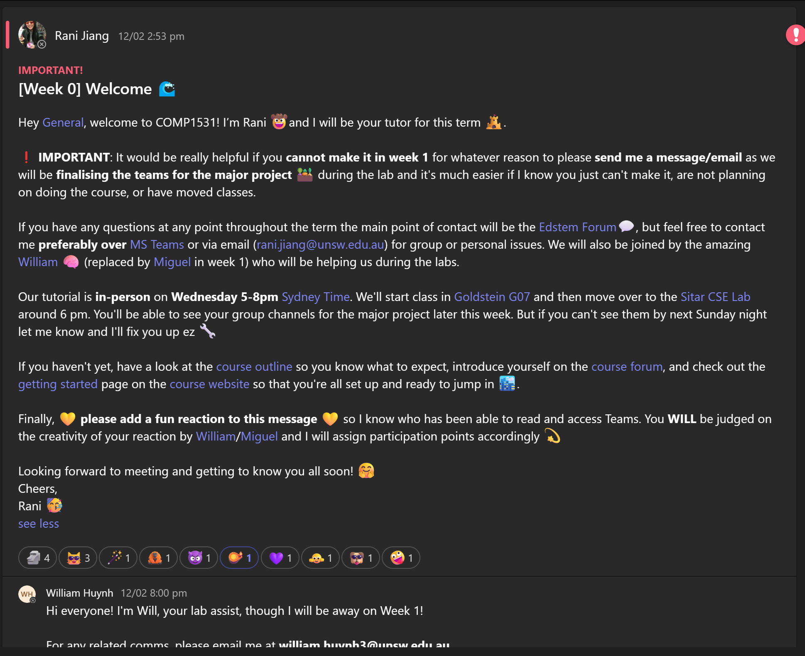

### A.1.1. Week 1

Notes:
 * Timeline on groups:
   * Monday night 10pm: Students & Groups are formed in the marking spreadsheet in "individual" tab. (Temporary) groups will be allocated.
   * **During tutorial class: Get the student groups to know each other in the group and the class. They can make changes to the groups. They will need to agree on their group formation during the class.**
   * Friday evening: admins create gitlab project repos for finished group allocations

Unique preparation / admin:
 * Welcome your class to 1531, we recommend doing this via email and mlaliases.
 * Create your tutorial MS Team.
 * Before you get into the tutorial, spend 5 minutes:
   * Double check the students have seen the notice posted on the ed forum.
   * Briefly go over the platforms the course uses (YouTube, Teams, GitLab, Ed, Course Website)

During a tutorial:
 * Make sure students know about attendance & participation marks. You can do
   this by marking off a roll infront of them (also helps in learning names!).
 * Make sure students know how you prefer to be contacted.
 * Get students seated in their temporarily allocated groups and working together in the intro activity.
   * **Make sure students know everyone in a group will get a different mark for the project.**
 * Make sure students know where to find tutorial solutions.

During a lab session:
 * During your project check in:
   * Get groups to swap contact information and discuss course expectations.
   * **Introduce to them the Team Contract**
   * Confirm all groups and make the necessary "swapping"; marking sheet & correct MS Teams channel.
 * Work hard to get students through lab01
 * Please note students will not have learned git by this point
 * Get to know the students too - have fun!

### A.1.2. Week 2

Notes:
 * N/A

Unique preparation / admin:
 * Cleaning up your groups:
   * On Monday morning of week 2, look up your class enrolments (accurate as of 5am the same day) and ensure the individual spreadsheet is accurate
     * Enrolments available at link similar to this: [https://cgi.cse.unsw.edu.au/~cs1531/25T2/enrolments](https://cgi.cse.unsw.edu.au/~cs1531/25T2/enrolments) (modify the term as required)

During a tutorial:
 * Make sure you re-enforce the points in the course outline around participation and attendance in tutorials contributes to your individual mark. For online classes, remind them that webcam in tutes can be treated for participation (in a large sense) and its the easiest way to get noticed

During a lab session:
 * For Project-check ins:
   * **Talk about the Team Contract with the groups.**
   * Ensure that the group has bi-weekly standup meeting times organised, iteration 0 specification has been discussed in  a meeting, at least 1 task per person has been assigned
   * Probe the group with the following questions:
     * How are you communicating now? How do you intend to communicate as you go on?
     * How often are you meeting (chatting on a call, reflecting)?
     * How often are you planning to have standups?
     * What progress have you made so far on the project?
       * How are you hoping to store your data?
       * How are you hoping to split up tasks between you?
     * Are there any clarifications you have around the project spec I can help you with?
   * Discuss the `data.md` section of iteration 0 with students, let them know there's no 'correct' answer, it's more just there to get them thinking about how data might be represented for a Teams-like application.


### A.1.3. Week 3

Notes:
 * Iteration 0 marking is due at 5pm on Friday of week 3

Unique preparation / admin:
 * N/A

During a tutorial:
 * N/A

During a lab session:
 * In the project check-in:
   * Get them setup with all the content from the "Working as a team" lecture
   * It's very important that this week you sit down with them and ask them how iteration 0 went and get them all to share what they think went well and what didn't
   * Ensure that iteration 1 specification has been discussed in a meeting, at least 1 task per person has been assigned
   * You can optionally ask the following questions as prompts:
     * How are you deciding to order your tests?
     * What does your data structure look like? Do you have any reservations or concerns with it?
     * What has been your biggest challenge so far working together? Where do you think you're most likely to lose marks?
     * How many meetings/standups did you do in the last week since we talked?
 * Lab Marking
   * This is the first week you will have to deal with re-runs for labs. The instructions are written in this guideline.

### A.1.4. Week 4

Notes:
 * N/A

Unique preparation / admin:
 * Look at enrolments to see if any students have dropped in week 4. From this week onwards no students will drop.
   * Enrolments available at link similar to this: [https://cgi.cse.unsw.edu.au/~cs1531/25T2/enrolments](https://cgi.cse.unsw.edu.au/~cs1531/25T2/enrolments) (modify the term as required)

During a tutorial:
 * N/A

During a lab session:
 * Go through the feedback for iteration 0 in more detail (both manual and automarking)
 * Ensure that for iter 1 that 1x function per person complete (tests and implementation in master)


### A.1.5. Week 5

Notes:
 * Iteration 1 marking is due at 5pm on Friday of week 5

Unique preparation / admin:
 *

During a tutorial:
 *

During a lab session:
 * Ensure with the group that:
   * Iteration 2 specification has been discussed in a meeting, at least 1 task per person has been assigned
   * Students have put the .gitlab-ci.yml file into their repo and have it running/working
   * Spend some time maybe giving them feedback on their last iteration?
   * You can optionally tackle these conversations with your group:
     * What is one thing you want to do better at in iteration 2 than you did iteration 1?
     * What's the blank for the next 10 days to complete the iteration?
     * How are you jugging all of these new features? How are you distributing workload between yourselves?
     * Any questions on the iteration 2 spec
     * Give them the chance to speak to you in private if they want to raise a group work concern

### A.1.7. Week 7

Notes:
 * N/A

Unique preparation / admin:
 * N/A

During a tutorial:
 * N/A

During a lab session:
 * Check in the project-check in:
   * Server routes for all iteration 1 functions complete and in master
1x iteration 2 route per person complete (HTTP tests and implementation in master)
   * Optionally you can ask these questions:
     * How is iteration 2 going? Any questions/concerns?
     * What are your priorities for finishing iteration 2?
     * How are you implementing persistence?
     * Have you tested your routes using an ARClient or the frontend?

### A.1.8. Week 8

Notes:
 * Iteration 2 marking is due at 5pm on Friday of week 8

Unique preparation / admin:
 * N/A

During a tutorial:
 *  N/A

During a lab session:
 * During your check in:
   * Iteration 3 specification has been discussed in a meeting, at least 1 task per person has been assigned

### A.1.9. Week 9

Notes:
 * N/A

Unique preparation / admin:
 * N/A

During a tutorial:
 *  N/A

During a lab session:
 * N/A

### A.1.10. Week 10

Notes:
 * Iteration 3 marking is due at 5pm on Monday of week 12

Unique preparation / admin:
 * N/A

During a tutorial:
 * N/A

During a lab session:
 * Must check following in tutorial:
   * Exceptions added across the project AND 1x iteration 3 route per person complete (HTTP tests and implementation in master)
   * You can optionally ask these questions:
     * Further feedback from iteration 2 and points to focus on for iteration 3
     * Any questions on the iteration 3 spec?
     * How are you allocating work to make sure everything gets done on time?
     * How are you deploying your project?
     * What bonus features are you thinking of implementing/have started implementing?


## A.2. Re-running automarked labs

### Rerun Conditions

Since lab solutions are released together with our automarking, we will __only re-run non-programming errors__ (e.g. typos, syntax errors, CI crashes) for students. __No re-runs are given for misinterpreting the specification__ (e.g. returning a string instead of an object for error cases or having incorrect key values such as 'name' instead of 'restaurantName'), missing edge cases or any other programming error, no matter how small.

Please note that for labs, reruns are __not__ intended to "provide a second chance for students to fix their mistakes", but rather "for students to be given a fair(er) mark for their initial submission".

If a particular line of code in a function causes the entire test suite to fail, the function's body should be fully commented out or removed (no marks will be awarded for this function) during the rerun.

Late submissions are not grounds for reruns. This includes forgetting to push code even if it was presumably committed on time, as commit time can be [unreliable](https://git.uwaterloo.ca/cscf/gitlab-assignments#caveats).

Re-run requests are __only valid within one week after the lab deadline__.

### Tutor & Lab Assist Instructions

1. Advise students to read through the lab automarking re-run guide from the course website.
1. Ensure the changes being made by the student do not violate any conditions mentioned previously
1. Ask the student to push their fixes to a new branch called `submission-fix`
1. Ask the student to create a merge request from `submission-fix` into the `submission` branch (**Note:** make sure it's **not master**)
1. Briefly check that students have followed all instructions correctly, then direct them to post on the course forum

### Special Role Instructions

Your responsibility is to oversee all lab reruns to ensure course-wide consistency.

1. Ensure the changes being made by the student do not violate any conditions mentioned previously
1. Merge the student's `submission-fix` branch into their `submission` branch
1. Click `retry` on the latest automarking pipeline job on the marking branch if it is possible. If this does not work (e.g. the job has been archived), go to `Pipelines > Run Pipeline > marking` to create a new job.

## A.3. Help Session Expectations, Notes, Workflow

### Rough Expectations

Below are some rough expectations for how many help session requests and forum queries each tutor should answer within 2 hours.

| Situation | Time per Request | Requests Resolved | Time per Query | Queries Resolved |
| --------- | ---------------- | ----------------- | -------------- | ---------------- |
| Ideal     | 8 minutes        | 15 requests       | 3 minutes      | 40 queries       |
| Good      | 10 minutes       | 12 requests       | 5 minutes      | 24 queries       |
| Okay      | 12 minutes       | 10 requests       | 8 minutes      | 15 queries       |
| Worst     | 15 minutes       | 8 requests        | 10 minutes     | 12 queries       |

Note that this is only a rough guideline - it does not account for unforeseen
circumstances. However, in the worst-case scenario (i.e. all students take up
the maximum time of 15 minutes), you should still have gotten through 8
students.

Please see the next few sections for some advice on how we can stick to this
guideline and efficiently assist the highest number of students in the limited
time we have :).

### Important Notes

1. Try to spend a **maximum of 15 minutes per student** (and most definitely not over 20 minutes). If you are stuck on a query, it is okay to:
    1. escalate the student to the priority queue on Hopper
    1. redirect the student to the forum and suggest that they can add "From Help Session" to their post title or content

    Chances are that another staff has encountered the issue before and can provide support more effectively, and this would enable more students to receive help at the help session rather than clogging up the queue :).

1. Please **do not go overtime**!
    - Your mental health matters, and you should only work during the hours that you are paid for :).
    - Ethical issues aside, this is also important for future-term budgeting and not setting the wrong expectations for tutors!

1. If the help session is empty, you are expected to **answer questions on the course forum**. This is a **requirement**.

1. For future term budgeting and planning, all tutors are expected to keep a tally of the number of hopper requests they've resolved for all attended sessions in the marking sheet. We recommend doing this as you go.

### Workflow

Since COMP1531 Help Sessions are hosted on MS Teams, below is one recommended workflow:

1. For 24T2, queues are pre-scheduled for help sessions. This means you do NOT need to create the queue yourself. But you should **share the room information**, join code or hopper link on MS Teams for students to access.
    <details close>
      <summary>click to view</summary>

      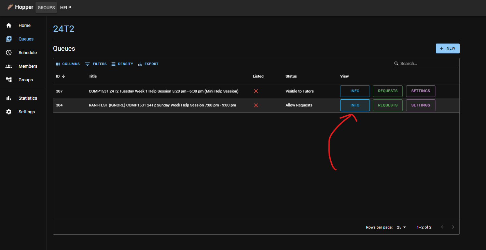

      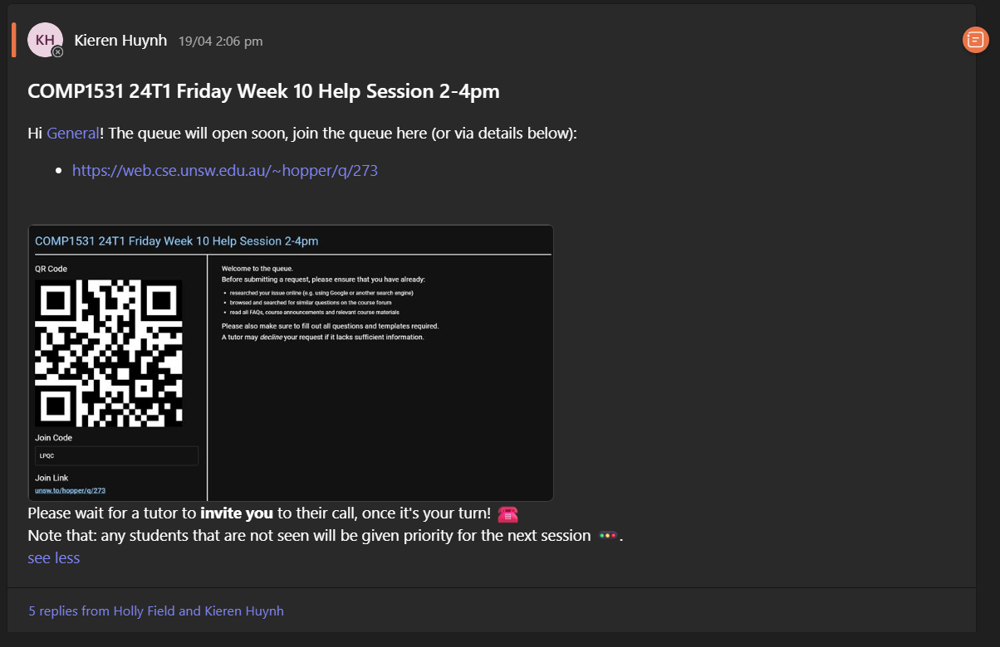
    </details>
2. In the relevant Team channel, each tutor can start their separate meeting. We recommend renaming this call to some variant of
    ```text
    DO NOT JOIN - Help Session - (Your Name)
    ```
    <details close>
    <summary>click to view</summary>

    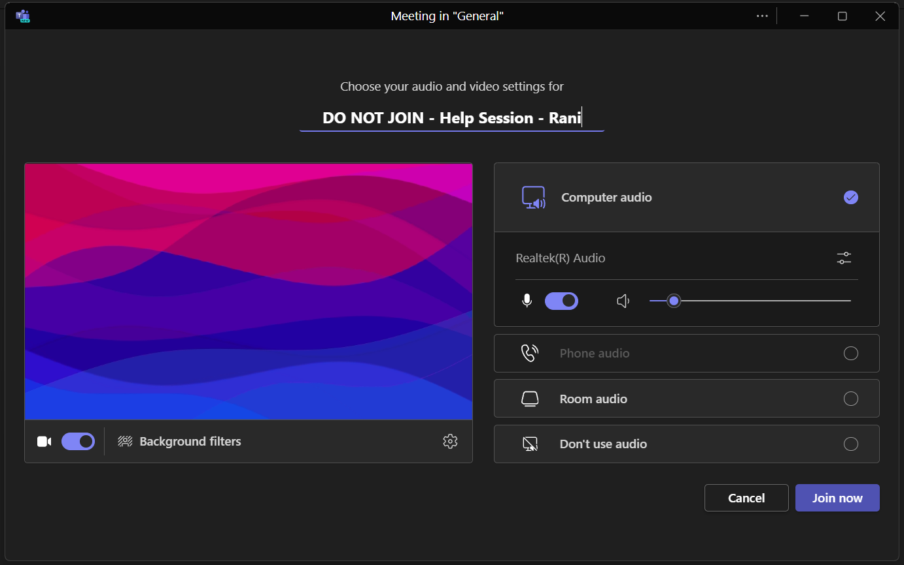
    </details>

3. After you've claimed a student request on Hopper, you can tag or invite that student to your room via their `zid`.
    <details close>
    <summary>click to view</summary>

    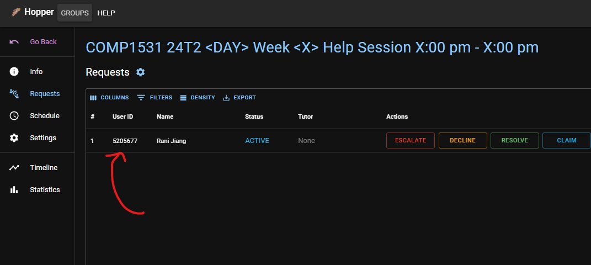
    </details>

    You can then either

    1. Tag the student using their `zID` in the "Chat" tab of the meeting

        <details close>
        <summary>click to view</summary>

        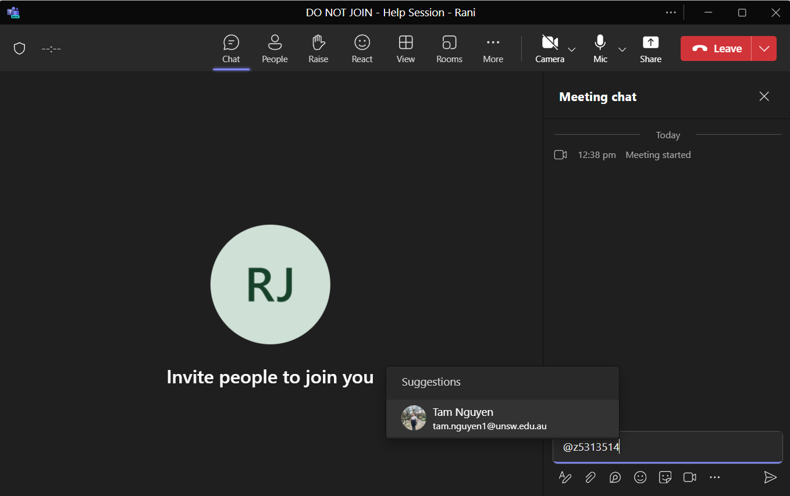

        </details>

    2. Request the student to join the call using their `zID` in the "People" tab of the meeting
        <details close>
        <summary>click to view</summary>

        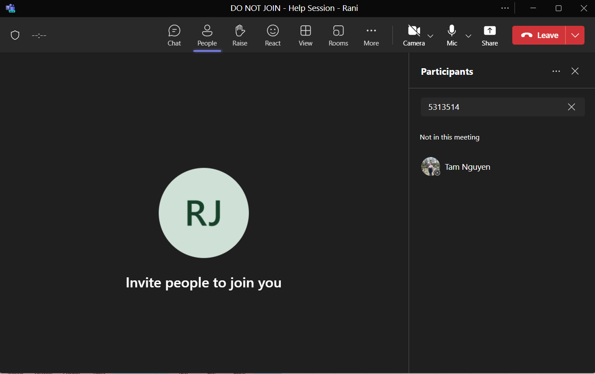

        </details>
4. After the help session finishes, remember that one tutor should click `End Session` so that we don't clutter up the main queue list. You can always change this back in the queue `Settings` if you need to follow up.
    <details close>
      <summary>click to view</summary>

      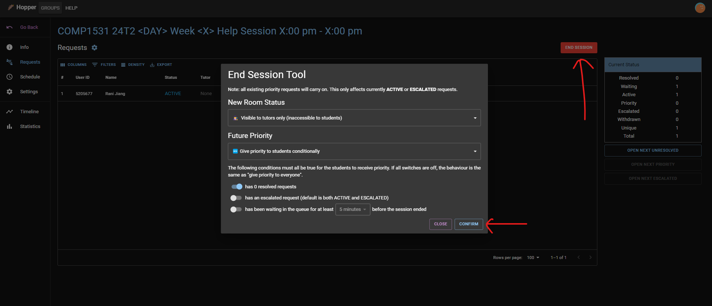
    </details>
5. When the queue is ended, don't forget to report on your session in the `help-sessions` tab of the Marking sheet.
    <details close>
      <summary>click to view</summary>

      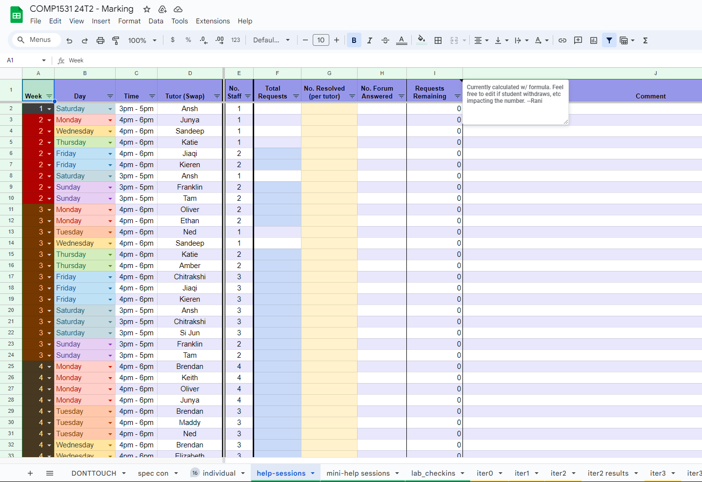
    </details>
    You can also see your stats, in the `Statistics > Contributors` sidebar and tab of a queue.
    <details close>
      <summary>click to view</summary>

      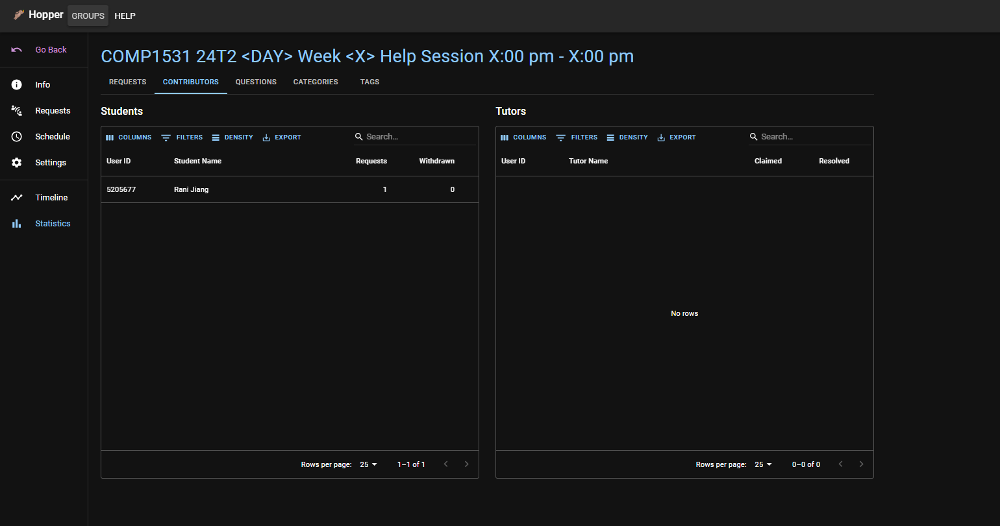
    </details>
6. Please also post about any **students you weren't able to help** (e.g. if they had a deployment or environment issue) in the #Help Sessions channel of the main tutor Team, so that the course can follow-up with them.

## Guidelines for forum managers

The forum health during and at the end of that period is your responsibility. Forum health generally involves the number of unresolved posts and other criteria listed as forum goals.
More specific responsibilities for each period include:

 * Responsible for investigating and resolving queries
 * Escalating queries you can't reasonably solve
 * Documenting official "undefined" or "tricky" behaviour in the pinned forum post

You don't need to do this alone! Though we hope, for the sake of consistency, you can take the majority of the work each period, please do let us know either early on or during if you think you might want help 😊

Optionally, we're also very happy for you to make fixes/improvements/suggestions. You can directly make a merge request to the appropriate staff repository and include this in a post on our MS Teams channel with an explanation of the problem students are facing.

## A.5. Signing up to Kahoot

> A teacher kahoot account can host up to 20 players, whereas a business/personal/home account can only host 10!
>
> The combination is Teacher + School
>
> 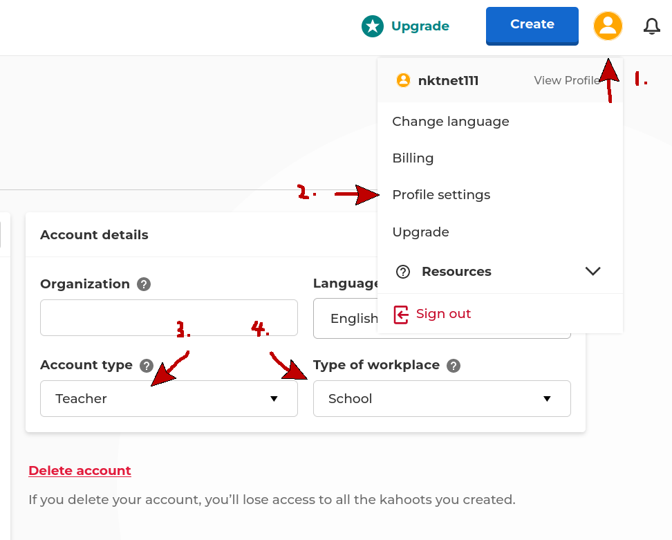
>
> 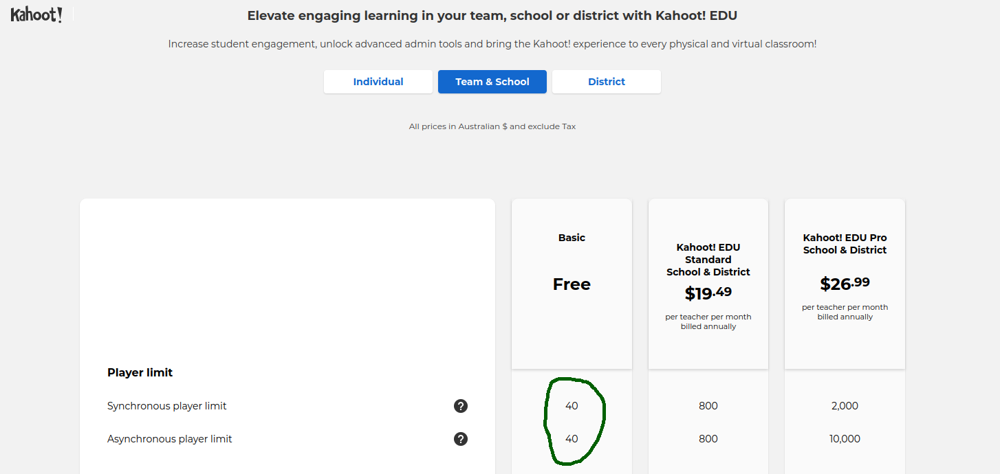
>
> More details [here](https://kahoot.com/schools/edu-school-and-district/?pricing-root=https://kahoot.com/schools/plans/)!

