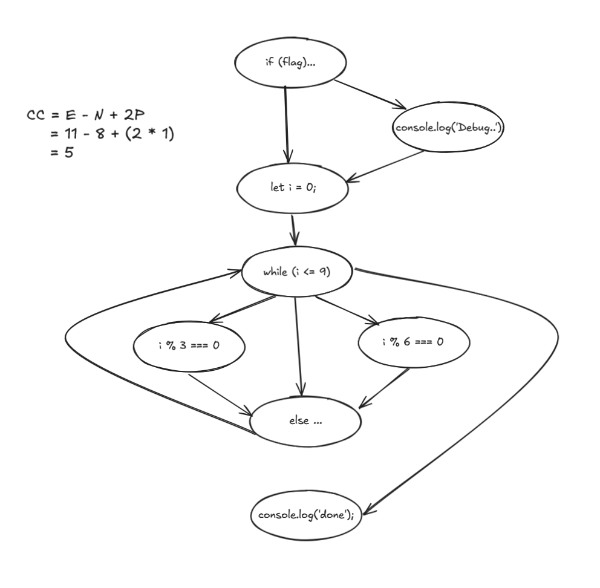

## Sample Answer
- Cyclomatic Complexity: *5*

Method 1: Draw a directed graph and use the formula:
- Cyclomatic Complexity = Edges - Nodes + 2 x Connected Componenents

One possible representation:

Alternatively, use the "decision points + 1" quick method.

## Marking Criteria
- 2 marks - correct cyclomatic complexity
